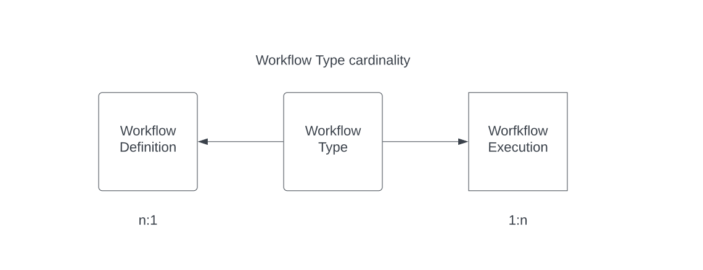
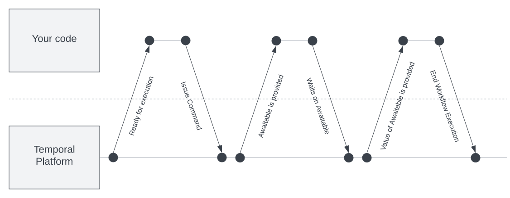
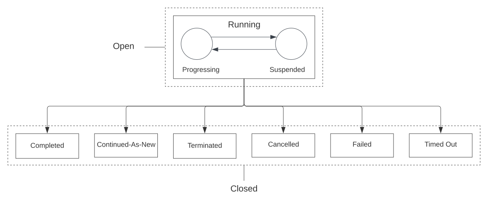
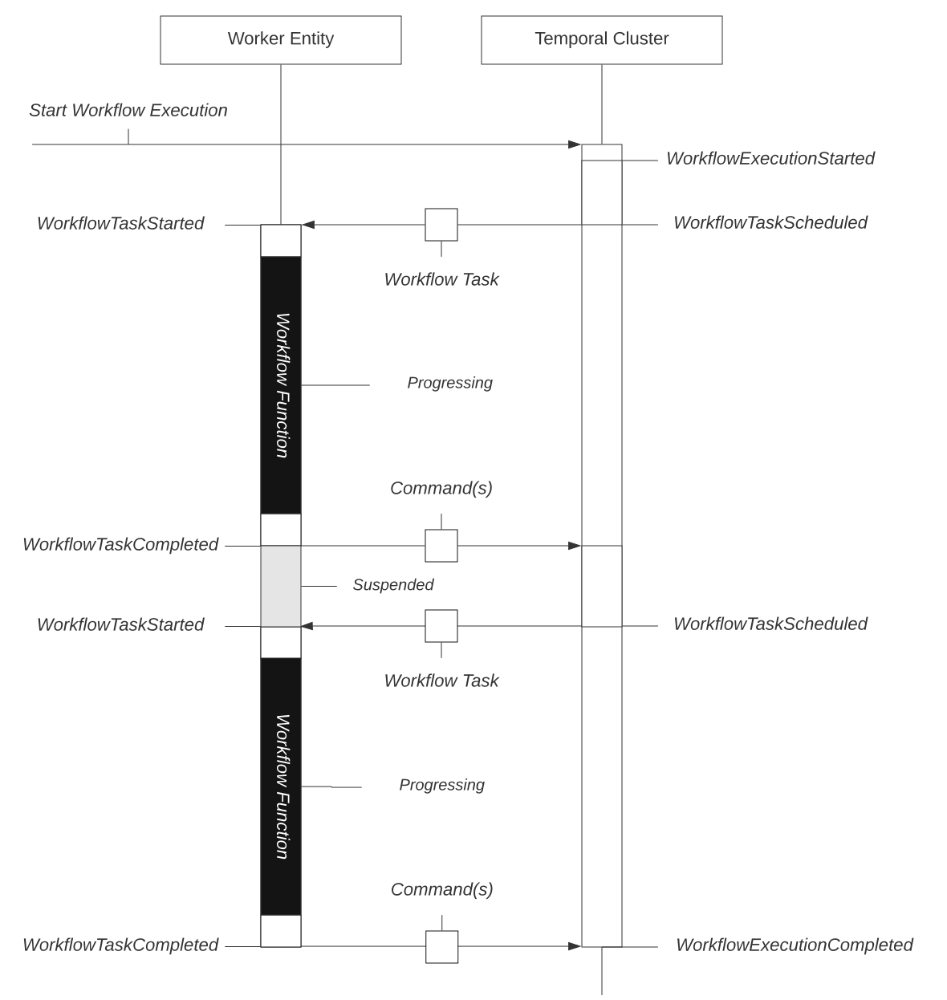
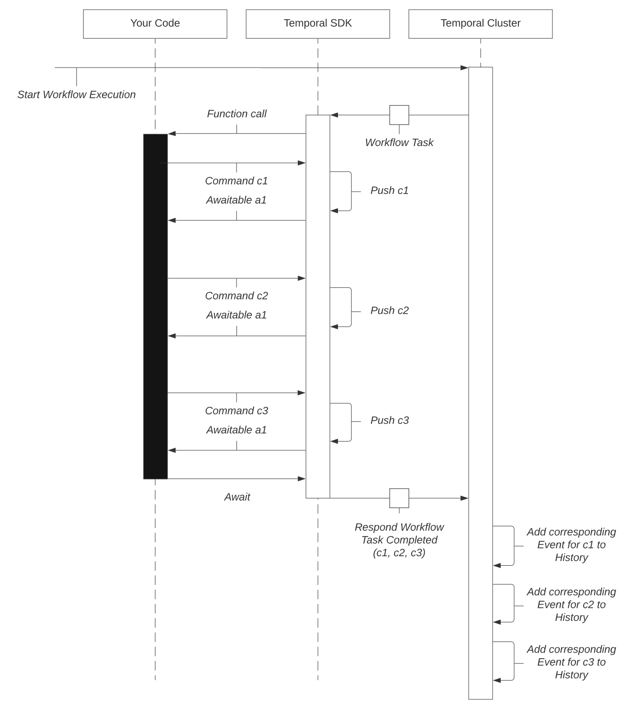

https://docs.temporal.io/workflows

在日常对话中，工作流一词通常指工作流类型、工作流定义或工作流执行。Temporal文档旨在明确区分它们。

## 工作流定义

工作流定义是定义工作流执行约束的代码。

工作流定义（Workflow Definition）通常也被称为工作流函数（Workflow Function）。在 Temporal 的文档中，工作流定义（Workflow Definition）指的是工作流执行实例的源码，而工作流函数（Workflow Function）指的是工作流函数执行实例的源码。

工作流执行一次有效执行完成，而工作流函数执行则在工作流执行的生命周期内多次执行。

我们强烈建议您使用具有相应 Temporal SDK 的语言编写工作流定义。

### 确定性约束

开发工作流定义的一个重要方面是确保它们表现出一定的确定性特征，即在重新执行相应的工作流函数执行（函数定义的实例）时，确保以相同的顺序发出相同的命令。

工作流执行的执行语义包括工作流函数的重新执行，这被称为 "重播"。在函数中使用工作流 API 会生成命令。命令告诉群集要创建哪些事件并将其添加到工作流执行的事件历史记录中。工作流函数执行时，发出的命令会与现有的事件历史记录进行比较。如果在事件历史记录中已经存在对应的事件，该事件与以相同顺序生成的命令相对应，并且该命令的某些特定元数据与事件的某些特定元数据相匹配，那么函数执行就会继续进行。

例如，使用 SDK 的 "执行活动/Execute Activity" API 会生成 ScheduleActivityTask 命令。在重新执行时调用该 API 时，会将该命令与序列中同一位置的事件进行比较。序列中的事件必须是 ActivityTaskScheduled 事件，其中的活动名称与命令中的名称相同。

如果生成的命令与现有事件历史记录中的命令不匹配，工作流执行将返回一个非确定性错误。

以下两个原因可能会导致命令生成顺序错误或生成错误的命令：

1. 对正在运行的工作流执行程序所使用的工作流定义进行了代码更改。
2. 存在固有的非确定逻辑（如内联随机分支）。

### 代码更改会导致非确定性行为

一旦有工作流执行依赖于工作流定义，工作流定义的更改就会非常有限。为了减轻代码更改带来的非确定性问题，我们建议使用工作流版本控制。

例如，假设我们有一个工作流定义，它定义了以下序列：

1. 启动并等待计时器/睡眠。
2. 产生并等待活动执行。
3. 完成。

我们启动一个 Worker 并生成一个使用该工作流定义的工作流执行。Worker 将发出 StartTimer 命令，工作流执行将暂停。

在计时器结束前，我们将工作流定义更改为以下序列：

1. 生成并等待活动执行。
2. 启动并等待计时器/休眠。
3. 完成。

当计时器启动时，下一个工作流任务将导致工作流函数重新执行。Worker 看到的第一个命令将是 ScheduleActivityTask 命令，这与预期的 TimerStarted 事件不符。

工作流执行将失败并返回非确定性错误。

下面举例说明在重新执行已包含事件的历史记录时，不会导致非确定性错误的微小更改：

- 更改计时器的持续时间，但以下情况除外：
  - 在 Java、Python 和 Go 中，将计时器的持续时间从或变为 0 是一种非确定性行为。
  - 在 .NET 中，将定时器的持续时间从或改为-1（表示 "无限"）是一种非确定行为。

- 更改参数：
  - 调用催生活动执行（本地或非本地）时的活动选项。
  - 调用催生子工作流执行时的子工作流选项。
  - 调用外部工作流执行的信号。
  - 为尚未发送给本工作流执行的信号类型添加信号处理器。

### 内在非确定性逻辑

内在非确定性是指工作流函数执行在重新执行时可能会发出不同的命令序列，而不管所有输入参数是否相同。

例如，工作流定义不能有根据本地时间设置或随机数分支（发出不同的命令序列）的内联逻辑。在下面具有代表性的伪代码中，local_clock() 函数返回的是本地时间，而不是 Temporal 定义的时间：

```javascript
fn your_workflow() {
  if local_clock().is_before("12pm") {
    await workflow.sleep(duration_until("12pm"))
  } else {
    await your_afternoon_activity()
  }
}
```

每个 Temporal SDK 都提供应用程序接口（API），使工作流定义的逻辑能够从不可靠的资源中获取和使用时间、随机数和数据。使用这些应用程序接口时，结果将作为事件历史的一部分存储，这意味着重新执行的工作流函数将发出相同的命令序列，即使涉及分支。

换句话说，所有不纯粹改变工作流执行状态的操作都应通过 Temporal SDK API 进行。

### 工作流版本控制

工作流版本功能可根据开发人员指定的版本标识符，在工作流定义内部创建逻辑分支。该功能适用于需要更新工作流程定义逻辑，但当前正在运行的工作流程执行依赖于该逻辑的情况。需要注意的是，在不使用版本控制应用程序接口的情况下，处理不同版本工作流定义的实用方法是在不同的任务队列上运行不同的版本。

### 处理不可靠的工作进程

在工作流定义中不处理工作进程故障或重新启动。

工作流函数执行完全无视工作进程的故障或停机。如果工作进程或时态集群本身发生故障，Temporal 平台会确保恢复工作流执行的状态，并恢复进度。工作流执行失败的唯一原因是代码出现错误或异常，而不是底层基础设施中断。


## 工作流类型

工作流类型是一个映射到工作流定义的名称。

- 单个工作流类型可实例化为多个工作流执行。
- 工作流类型的作用域是任务队列。如果使用完全不同的 Worker，可以将相同的工作流类型名称映射到不同的工作流定义。



> 这里没有太看懂。我自己的理解是：
>
> “单个工作流类型可实例化为多个工作流执行” 这个容易理解，一个类型的工作流可以被反复执行多次，每次都是一个 workflow execution。
>
> “工作流类型的作用域是任务队列。如果使用完全不同的 Worker，可以将相同的工作流类型名称映射到不同的工作流定义。“ —— 这是说如果在不通的工作背景下（也就是不同的worker），同一个名字的 工作流类型 是可以映射到不同的工作流定义。比如说 ”取款“ 这个 工作流类型在 柜台/取款机/VIP室 就可以映射为不同的工作流定义（有不同的实现。）

## 工作流执行

Temporal 工作流执行是一种持久、可靠和可扩展的函数执行。它是 Temporal 应用程序的主要执行单元。

每个 Temporal 工作流执行都能独占访问其本地状态。它与所有其他工作流执行同时执行，并通过信号与其他工作流执行通信，通过活动与环境通信。单个工作流执行的规模和吞吐量有限，而一个 Temporal 应用程序可以由数百万到数十亿个工作流执行组成。

**持久性**

持久性是指没有强加的时间限制。

工作流执行之所以是持久的，是因为它能一次有效地执行 Temporal 工作流定义（也称为 Temporal 工作流函数），也就是您的应用程序代码--无论您的代码执行了几秒还是几年。

**可靠性**

可靠性是指出现故障时的响应能力。

工作流执行之所以可靠，是因为它在发生故障后可以完全恢复。Temporal 平台可确保工作流执行的状态在发生故障和中断时仍然存在，并从最新状态恢复执行。

**可扩展性**

可扩展性是指在负载情况下的响应能力。

单个工作流执行的规模和吞吐量是有限的，但却具有可扩展性，因为它可以根据负载情况不断更新。Temporal 应用程序之所以具有可扩展性，是因为 Temporal 平台能够支持数百万到数十亿个工作流同时执行，而这是通过 Temporal 集群和工作进程的设计和性质实现的。

### 重放

重放是工作流执行重新开始的方法。在重放过程中，会根据现有的事件历史记录检查生成的命令。为了使工作流执行具有可恢复性、可靠性和持久性，重放是必要的，也是经常发生的。

更多信息，请参阅确定性约束。

如果发生故障，工作流执行将从事件历史记录中最后一次记录事件的位置重新开始。

### 命令和可等待项

工作流执行有两个功能：

1. 发布命令
2. 等待可等待对象（通常称为 Future）。

命令生成和等待: 



通过使用工作流定义中的工作流应用程序接口（Workflow API），可以发出命令并提供可等待项。

每当执行工作流函数时，就会生成命令。工作进程监督命令的生成，并确保其与当前事件历史记录相对应。(更多信息，请参阅 "确定性约束"。）工作进程对命令进行批处理，然后每当工作流函数到达没有 "等待" 结果就无法继续执行的位置时，工作进程就会暂停执行，并将命令发送到群集。

工作流执行只能阻止通过 Temporal SDK API 提供的 "Awaitable/可等待" 的进程。在使用以下 API 时，会提供可等待项：

- 等待：可以使用显式 "Await" API 阻止进程。
- 请求取消另一个工作流执行： 在确认其他工作流执行已取消时，进程可以阻塞。
- 发送信号： 进程可以在确认信号已发送时阻塞。
- 生成子工作流执行： 当确认子工作流执行已开始以及子工作流执行的结果时，进程就会阻塞。
- 生成活动执行： 进度会因活动执行的结果而受阻。
- 启动定时器：在定时器启动之前，进度可能会受阻。

### 状态

工作流程执行可以是 "打开/*Open*" 或 "关闭/*Closed*"。

工作流程执行状态:



#### 打开

打开状态表示工作流执行能够取得进展。

- 运行中： 工作流执行的唯一打开状态。当工作流执行处于运行状态时，它要么正在积极推进，要么正在等待。

#### 关闭

已关闭 状态表示由于以下原因之一，工作流执行无法取得进一步进展：

1. Cancelled / 已取消： 工作流执行成功处理了取消请求。
2. Completed / 已完成： 工作流执行已成功完成。
3. Continued-As-New： 工作流执行以新的方式继续。
4. Failed / 失败： 工作流执行返回错误并失败。
5. Terminated / 已终止： 工作流执行已终止。
6. Timed Out / 超时： 工作流执行达到超时限制。


### 工作流执行链

工作流执行链是共享相同工作流标识的工作流执行序列。链中的每个环节通常称为一个工作流运行。序列中的每个工作流运行由以下方式之一连接：

- Continue-As-New
- 重试
- Temporal Cron 作业

工作流执行由其命名空间、工作流 Id 和运行 Id 唯一标识。

工作流执行超时适用于工作流执行链。工作流运行超时适用于单个工作流执行（工作流运行）。

### 事件循环

工作流执行由一系列称为 "事件历史" 的事件组成。事件由 Temporal cluster 创建，以响应 Temporal 客户端请求的命令或操作（如启动工作流执行的请求）。

工作流执行：



### 时间限制

**工作流的运行时间有限制吗？**

没有，工作流执行的运行时间没有限制。

但是，如果工作流执行打算无限期运行，那么在编写时就应该小心谨慎。Temporal 集群会存储工作流执行整个生命周期的完整事件历史记录。Temporal Cluster 会在 10Ki （10,240）个事件后记录警告，并在添加新事件时定期记录更多警告。如果事件历史记录超过 50Ki（51,200）个事件，工作流执行将被终止。

为防止工作流执行失控，可以使用工作流执行超时、工作流运行超时或两者兼用。工作流执行超时可用于限制工作流执行链的持续时间，工作流运行超时可用于限制单个工作流执行（运行）的持续时间。

您可以使用  Continue-As-New 功能关闭当前的工作流执行，并在一次原子操作中创建一个新的工作流执行。由 Continue-As-New 生成的工作流执行具有相同的工作流 ID、新的运行 ID 和新的事件历史记录，并传递所有适当的参数。例如，对于产生大量事件历史记录的长期运行工作流执行，每天使用一次 Continue-As-New 是合理的。

### 限制

并发工作流执行次数没有限制。

不过，工作流执行的事件历史记录的长度和大小有限制（默认情况下为 51,200 个事件和 50 MB）。

某些类型的未完成操作的数量也有限制。

每个进行中的活动都会在工作流执行的可变状态中生成一个元数据条目。单个工作流执行的可变状态中条目过多会导致持久性不稳定。为了保护系统，Temporal 为每个工作流执行设定了未完成活动、子工作流、信号或取消请求的最大数量限制（默认情况下，每种操作类型的限制数量为 2000 个）。一旦达到了某一操作类型的限制，如果工作流执行试图启动该类型的其他操作（通过生成 ScheduleActivityTask、StartChildWorkflowExecution、SignalExternalWorkflowExecution 或 RequestCancelExternalWorkflowExecution 命令），将无法启动（工作流任务执行将失败并重试）。

这些限制通过以下动态配置键设置：

- `NumPendingActivitiesLimit`
- `NumPendingChildExecutionsLimit`
- `NumPendingSignalsLimit`
- `NumPendingCancelRequestsLimit`

### 命令

命令是工作流任务执行完成后，由 Worker 向 Temporal cluster 发出的请求操作。j

集群所采取的行动将作为事件记录在工作流执行的事件历史中。工作流执行可以等待由某些命令产生的某些事件。

命令是通过在代码中使用工作流 API 生成的。在工作流任务执行期间，可能会生成多个命令。在工作流任务执行到工作流函数所能达到的程度后，这些命令会被分批发送到集群，作为工作流任务执行完成请求的一部分。当有工作流任务执行完成请求时，事件历史中总会出现 WorkflowTaskStarted 和 WorkflowTaskCompleted 事件。

通过在代码中使用工作流 API 生成命令：



命令在命令参考中进行了描述，并在 temporal gRPC API 中进行了定义。

### 事件

事件由 temporal 集群创建，以响应外部事件和工作流执行所产生的命令。每个事件都与服务器 API 中定义的枚举相对应。

所有事件都记录在事件历史记录中。

所有可能出现在工作流执行事件历史记录中的事件列表都在事件参考中提供。

### 活动事件

在活动执行的不同阶段，会有七个与活动相关的事件被添加到事件历史记录中：

- 当工作流任务执行到启动/执行活动的代码行时，工作程序会将活动类型和参数发送到 temporal 集群，然后集群会将 ActivityTaskScheduled 事件添加到事件历史记录中。
- 当 ActivityTaskScheduled 被添加到历史记录中时，temporal 集群会将相应的活动任务添加到任务队列中。
- 轮询该任务队列的 Worker 会拾取活动任务并运行活动函数或方法。
- 如果活动函数返回，则 Worker 会向集群报告完成情况，集群会将 ActivityTaskStarted 和 ActivityTaskCompleted 添加到事件历史记录中。
- 如果活动函数抛出不可重试的失败，集群会将 ActivityTaskStarted 和 ActivityTaskFailed 添加到事件历史记录中。
- 如果活动函数抛出错误或可重试失败，集群会调度活动任务重试以添加到任务队列（除非您已达到重试策略的最大尝试值，在这种情况下，群集会将 ActivityTaskStarted 和 ActivityTaskFailed 添加到事件历史记录）。
- 如果在活动函数返回或抛出之前，活动的 开始到关闭（start-to-close） 超时已过，集群就会安排重试。
- 如果在活动执行完成前活动的 "调度到关闭" 已经超时，或如果在 Worker 获得活动任务前 "调度到开始" 已经超时，集群将写入 ActivityTaskTimedOut。
- 如果活动被取消，集群会将 ActivityTaskCancelRequested 写入事件历史记录；如果活动接受取消，集群会将 ActivityTaskCanceled 写入事件历史记录。


> 注意：
> 
> 当活动正在运行和重试时，ActivityTaskScheduled 是历史记录中唯一与活动相关的事件： ActivityTaskStarted 会与 ActivityTaskCompleted 或 ActivityTaskFailed 等终端事件一起被写入。


### 事件历史记录

应用程序的仅附加的事件日志。

- 事件历史记录由 Temporal 服务持久保存，可从崩溃或故障中无缝恢复应用程序状态。

- 它还可作为审计日志用于调试。

#### 事件历史限制

Temporal 群集会存储工作流执行整个生命周期的完整事件历史记录。

Temporal Cluster 会在 10Ki （10,240）个事件后记录警告，并在添加新事件时定期记录其他警告。如果事件历史记录超过 50Ki（51,200）个事件，工作流执行将被终止。

### Continue-As-New

Continue-As-New 是一种机制，通过这种机制，最新的相关状态会传递给新的工作流执行，并带有新的事件历史记录。

作为一项预防措施，temporal 平台将事件历史记录总数限制为 51200 个事件或 50 MB，并在超过 10240 个事件或 10 MB 后发出警告。为防止工作流执行的事件历史记录超过此限制而失败，可使用 Continue-As-New 以新的事件历史记录启动新的工作流执行。

通过参数传递给工作流执行或通过结果值返回的所有值都会记录到事件历史记录中。在名称空间的保留期内，temporal 集群会存储工作流执行的完整事件历史记录。周期性执行许多活动的工作流执行有可能达到大小限制。

过大的事件历史记录可能会对工作流执行的性能产生不利影响。例如，在工作流工作者发生故障的情况下，必须从 temporal 集群中提取完整的事件历史记录，并通过工作流任务交给另一个工作者。如果事件历史记录非常大，加载可能需要一些时间。

通过 Continue-As-New 功能，开发人员可以完成当前的工作流执行，并以原子方式启动一个新的工作流。

新的工作流执行具有相同的工作流标识（Workflow Id），但运行标识（Run Id）不同，并且有自己的事件历史记录。

就 temporal Cron 作业而言，Continue-As-New 其实在内部也有同样的作用。

### 重置

重置（reset）会终止工作流执行，删除事件历史记录中截至重置点的进度，然后创建一个具有相同工作流类型和 Id 的新工作流执行来继续执行。

### 运行标识（run ID）

Run Id 是工作流执行的全局唯一平台级标识符。

当前运行标识（Run Id）是可变的，在工作流重试期间可能会发生变化。由于工作流重试会更改运行标识（Run Id），因此不应依赖于存储当前运行标识（Run Id）或将其用于任何逻辑选择，否则会导致非确定性问题。

Temporal 保证在任何给定时间内，只有一个具有给定工作流 Id 的工作流执行处于打开状态。但当一个工作流执行达到关闭状态时，有可能会有另一个具有相同工作流 Id 的工作流执行处于打开状态。例如，Temporal Cron Job 是一连串工作流执行，它们都具有相同的工作流 ID。链中的每个工作流执行都被视为一个运行（Run）。

运行标识（run ID）唯一标识工作流执行，即使它与其他工作流执行共享一个工作流标识（workflow ID）。

#### 哪些操作会导致非确定性问题？

ContinueAsNew、Retry、Cron 和 Reset 等操作会创建一个由 first_execution_run_id 标识的工作流执行链。

每个操作都会在链运行中创建一个新的工作流执行，并将其信息保存为 first_execution_run_id。因此，每次对工作流执行进行操作时都会更新运行标识（run ID）。

- first_execution_run_id 是链运行中第一个工作流执行的运行标识。
- original_execution_run_id 是 WorkflowExecutionStarted 事件发生时的运行标识。

工作流重置（Workflow Reset）会更改第一个执行的运行标识（Run Id），但会保留原始执行的运行标识（Run Id）。例如，当链中的一个新工作流执行启动时，它会将其 Run Id 保存在 original_execution_run_id 中。重置不会更改该字段，但会更新当前的 Run Id。

### 工作流 ID

工作流标识（Workflow Id）是工作流执行的一个可定制的应用程序级标识符，对于命名空间内的开放的工作流执行来说是唯一的。

- 如何设置工作流标识

工作流标识是指业务流程标识，如客户标识或订单标识。

工作流标识重用策略可用于管理是否可以重用工作流标识。基于工作流标识重用策略，temporal 平台可保证命名空间内工作流标识的唯一性。

工作流执行可通过其名称空间、工作流标识和运行标识在所有名称空间中唯一标识。

#### 工作流标识重用策略

工作流标识重用策略（Workflow Id Reuse Policy）是指，如果某个工作流标识已被前一个工作流执行（现已关闭）使用，则该工作流执行是否允许以该工作流标识启动。

无论工作流标识重用策略如何，新的工作流执行都不可能使用与另一个开放式工作流执行相同的工作流标识。在某些情况下，如果尝试生成的工作流 Id 与当前打开的工作流 Id 相同，则会导致 "工作流执行已启动" 错误。

工作流 ID 重用策略可以有以下其中一个值：

- 允许重复： 无论之前具有相同工作流标识的工作流执行是否处于关闭状态，都允许工作流执行存在。如果没有指定，这是默认策略。当工作流执行与之前已关闭的工作流执行具有相同的工作流 ID 时，可以使用此策略。
- 只允许重复失败： 只有在具有相同工作流标识的前一个工作流执行没有已完成状态时，才允许工作流执行存在。当需要重新执行失败、超时、终止或取消的工作流执行并保证已完成的工作流执行不会被重新执行时，请使用此策略。
- 拒绝重复： 如果之前的工作流执行具有相同的工作流 Id，则无论关闭状态如何，工作流执行都不能存在。在给定的保留期内，一个命名空间内每个工作流 Id 只能有一个工作流执行时，请使用此功能。

运行时终止： 指定如果具有相同工作流标识的工作流执行已在运行，则应终止该工作流执行，并启动具有相同工作流标识的新工作流执行。该策略允许在任何给定时间内只有一个具有特定工作流 ID 的工作流执行在运行。
工作流标识重复使用策略只有在具有相同工作流标识的已关闭工作流执行存在于相关 N

