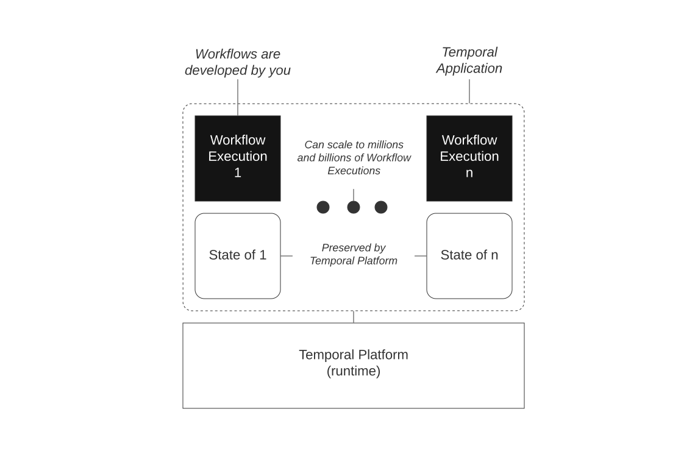
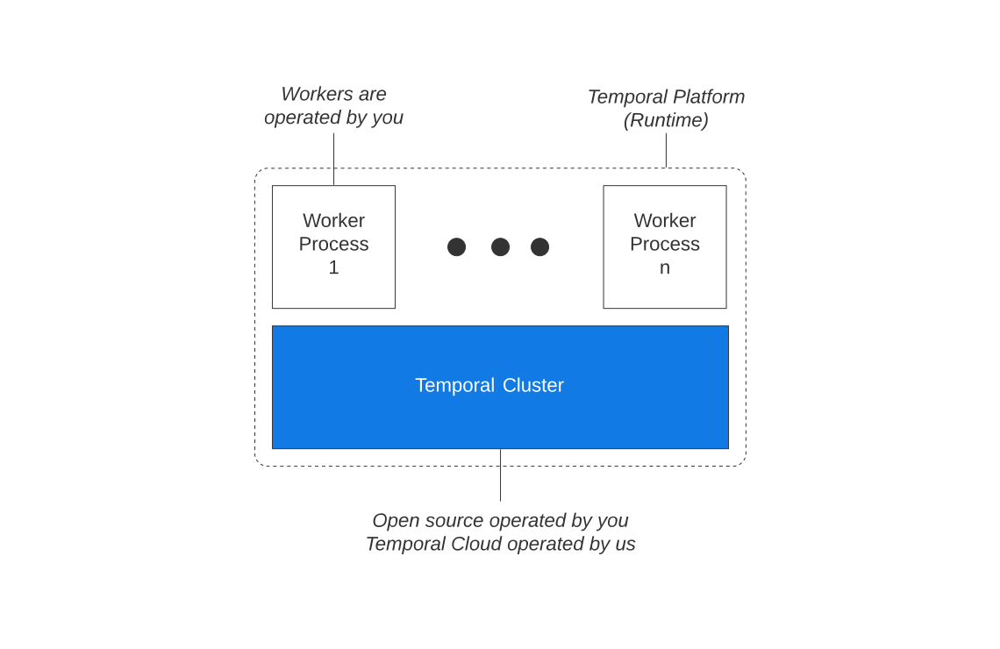

## 首页介绍

### Temporal是什么？

Temporal 网站首页的介绍是：

> Code for more reliable systems
>
> 编写更可靠的系统代码
>
> Temporal is an open source programming model that can simplify your code, make your applications more reliable, and help you deliver more features faster.
>
> Temporal 是一种开源编程模型，可以简化代码，提高应用程序的可靠性，并帮助您更快地提供更多功能。

口号是：

> **Fail less - Fail better**
>
> 更少失败 - 更好失败

提出要对以下内容 Just say no to( 拒绝) :

- Unresponsive, overloaded services / 反应迟钝、超负荷的服务

- Process crashes / 进程崩溃

- Network outages / 网络中断

- Race conditions / 竞赛条件

- Duplicate or incomplete transactions / 重复或不完整的事务

- Time lags or timeouts / 时间滞后或超时


### 智能代码

Temporal 简化了应用程序逻辑，使代码更易于维护，提高开发人员的工作效率。您可以通过这个汇款应用程序示例亲自体验一下，它将 241 行代码减少到了 98 行。

这是241 行的代码：

```go
package main

import (
	"context"
	"encoding/json"
	"errors"
	"fmt"
	"log"
	"math"
	"time"
)

type Status uint32

const (
	Started Status = iota
	Failed
	Succeeded
	Withdrawing
	Depositing
	Refunding
)

// ErrStorageConflict is returned by the storage API for the CompareAndSwap operation
var ErrStorageConflict = errors.New("storage conflict")

// ErrInsufficientFunds is returned by the bank API, considered a non-retryable business level error
var ErrInsufficientFunds = errors.New("insufficient funds")

// ErrAccountNotFound is returned by the bank API, considered a non-retryable business level error
var ErrAccountNotFound = errors.New("account not found")

type BankingService interface {
	Withdraw(accountNumber string, amount int, referenceID string) (string, error)
	Deposit(accountNumber string, amount int, referenceID string) (string, error)
}

type Persistence interface {
	Load(ctx context.Context, key string) (state interface{}, err error)
	CompareAndSwap(ctx context.Context, key string, state interface{}, expected interface{}) error
}

// Task pulled off a persistent task queue
type Task struct {
	QueueName string
	Payload   []byte
	Attempt   uint
}

type Consumer func(ctx context.Context, task Task)

// Queue represents a persistent task queue
type Queue interface {
	Enqueue(queue string, payload []byte) error
	Consume(queue string, consumer Consumer)
	Ack(task Task)
	RetryLater(task Task, duration time.Duration)
}

type TransactionInput struct {
	ReferenceID     string
	SourceAccountID string
	TargetAccountID string
	Amount          int
	// Used to report errors from activities
	ErrorMessage string
	// Used to verify process consistency
	LastStatus Status
}

type ActivityInput struct {
	Type      string
	AccountID string
	// Used to extract information about the transaction and forward it back to the transaction handler
	Transaction TransactionInput
}

type Worker struct {
	queue       Queue
	persistence Persistence
	bank        BankingService
}

func (w *Worker) ProcessMoneyTransferEvent(ctx context.Context, task Task) error {
	var input TransactionInput
	if err := json.Unmarshal(task.Payload, &input); err != nil {
		log.Printf("Failed to unmarshal payload: %v", err)
		// Enqueue in dead letter queue for human inspection
		return moveToDeadLetterQueue(w.queue, task)
	}
	anyStatus, err := w.persistence.Load(ctx, input.ReferenceID)
	if err != nil {
		return err
	}
	status, ok := anyStatus.(Status)
	if !ok {
		log.Printf("Failed to load status from DB, got: %v", anyStatus)
		return nil // discard this task, we don't know what to do with it
	}
	if status < input.LastStatus {
		// CompareAndSwap for the previous ProcessMoneyTransferEvent iteration has not completed before we got an activity completion.
		// Return an error and backoff retrying this task until our process is in consistent sate.
		return errors.New("got activity completion for uncommited workflow state")
	}
	if status > input.LastStatus {
		log.Printf("Invalid status in task, got: %v, expected: %v", input.LastStatus, status)
		return nil // discard this task, we probably generated duplicate activities due to a crash before committing previous status
	}

	prevStatus := status

	switch status {
	case Started:
		status = Withdrawing
		activityInput := ActivityInput{Type: "withdraw", AccountID: input.SourceAccountID, Transaction: input}
		if err := scheduleActivity(w.queue, activityInput); err != nil {
			return err
		}
	case Withdrawing:
		if input.ErrorMessage != "" {
			// Could not withdraw, abort
			status = Failed
		} else {
			status = Depositing
			activityInput := ActivityInput{Type: "deposit", AccountID: input.TargetAccountID, Transaction: input}
			if err := scheduleActivity(w.queue, activityInput); err != nil {
				return err
			}
		}
	case Depositing:
		if input.ErrorMessage != "" {
			status = Refunding
			// Reset the error message
			input.ErrorMessage = ""
			activityInput := ActivityInput{Type: "refund", AccountID: input.SourceAccountID, Transaction: input}
			if err := scheduleActivity(w.queue, activityInput); err != nil {
				return err
			}
		} else {
			status = Succeeded
		}
	case Refunding:
		if input.ErrorMessage != "" {
			// Critical transaction failure, cannot refund.
			// In a real world example a human operator would probably need to examine this transaction.
			status = Failed
		} else {
			status = Succeeded
		}
	default:
		return nil // discard this task, transaction has already completed. This shouldn't happen
	}

	// Since we already enqueued tasks before storing the state we might generate duplicate tasks in case storage returns an error.
	// This is okay for our case because we use a unique transaction ID as an idempotency token.
	// Temporal prevents this situation by committing workflow state and the request to schedule an activity in a single transaction.
	// This API will fail in case the status was incremented concurrently.
	err = w.persistence.CompareAndSwap(ctx, input.ReferenceID, status, prevStatus)
	if err != nil && !errors.Is(err, ErrStorageConflict) {
		return err
	}
	return nil
}

func (w *Worker) ProcessActivity(ctx context.Context, task Task) error {
	var input ActivityInput
	if err := json.Unmarshal(task.Payload, &input); err != nil {
		log.Printf("Failed to unmarshal payload: %v", err)
		return moveToDeadLetterQueue(w.queue, task)
	}
	tx := input.Transaction

	var operationErr error
	switch input.Type {
	case "deposit":
		_, operationErr = w.bank.Deposit(input.AccountID, tx.Amount, fmt.Sprintf("%s-deposit", tx.ReferenceID))
	case "withdraw":
		_, operationErr = w.bank.Withdraw(input.AccountID, tx.Amount, fmt.Sprintf("%s-withdraw", tx.ReferenceID))
	case "refund":
		_, operationErr = w.bank.Deposit(input.AccountID, tx.Amount, fmt.Sprintf("%s-refund", tx.ReferenceID))
	default:
		operationErr = fmt.Errorf("not implemented")
	}

	if operationErr != nil {
		if errors.Is(operationErr, ErrAccountNotFound) || errors.Is(operationErr, ErrInsufficientFunds) {
			// Business error, report back to transaction task
			tx.ErrorMessage = operationErr.Error()
		} else {
			// Transient error, retry later
			return operationErr
		}
	}
	payload, err := json.Marshal(tx)
	if err != nil {
		log.Printf("Failed to marshal payload: %v", err)
		// Enqueue in dead letter queue for human inspection
		return moveToDeadLetterQueue(w.queue, task)
	}
	if err := w.queue.Enqueue("transactions", payload); err != nil {
		return err
	}
	return nil
}

// Run is the entry point for our program
func Run(queue Queue, persistence Persistence, bank BankingService) {
	worker := Worker{queue, persistence, bank}
	handleErrors := func(consumer func(ctx context.Context, task Task) error) Consumer {
		return func(ctx context.Context, task Task) {
			err := consumer(ctx, task)
			if err != nil {
				log.Printf("Failed to process task: %v", err)
				queue.RetryLater(task, calcBackoff(task))
			} else {
				queue.Ack(task)
			}
		}
	}

	queue.Consume("money-transfer-events", handleErrors(worker.ProcessMoneyTransferEvent))
	queue.Consume("money-transfer-activities", handleErrors(worker.ProcessActivity))
}

func scheduleActivity(queue Queue, input ActivityInput) error {
	payload, err := json.Marshal(input)
	if err != nil {
		return err
	}
	return queue.Enqueue("money-transfer-activities", payload)
}

// calcBackoff calculates exponential backoff without jitter
func calcBackoff(task Task) time.Duration {
	initialInterval := float64(time.Millisecond) * 500
	return time.Duration(initialInterval * math.Pow(2, float64(task.Attempt)))
}

func moveToDeadLetterQueue(queue Queue, task Task) error {
	return queue.Enqueue(fmt.Sprintf("%s-DLQ", task.QueueName), task.Payload)
}
```

temporal的98 行代码：

```go

package app

import (
	"context"
	"fmt"
	"time"

	"go.temporal.io/sdk/temporal"
	"go.temporal.io/sdk/workflow"
)

type BankingService interface {
	Withdraw(accountNumber string, amount int, referenceID string) (string, error)
	Deposit(accountNumber string, amount int, referenceID string) (string, error)
}

type Activities struct {
	bank BankingService
}

type PaymentDetails struct {
	ReferenceID   string
	SourceAccount string
	TargetAccount string
	Amount        int
}

func MoneyTransfer(ctx workflow.Context, input PaymentDetails) (string, error) {
	// RetryPolicy specifies how to automatically handle retries if an Activity fails.
	retrypolicy := &temporal.RetryPolicy{
		InitialInterval:        time.Second,
		BackoffCoefficient:     2.0,
		MaximumInterval:        100 * time.Second,
		MaximumAttempts:        0, // unlimited retries
		NonRetryableErrorTypes: []string{"ErrInvalidAccount", "ErrInsufficientFunds"},
	}

	options := workflow.ActivityOptions{
		// Timeout options specify when to automatically timeout Activity functions.
		StartToCloseTimeout: time.Minute,
		// Optionally provide a customized RetryPolicy.
		// Temporal retries failed Activities by default.
		RetryPolicy: retrypolicy,
	}

	// Apply the options.
	ctx = workflow.WithActivityOptions(ctx, options)

	// Withdraw money.
	var withdrawOutput string

	withdrawErr := workflow.ExecuteActivity(ctx, "Withdraw", input).Get(ctx, &withdrawOutput)

	if withdrawErr != nil {
		return "", withdrawErr
	}

	// Deposit money.
	var depositOutput string

	depositErr := workflow.ExecuteActivity(ctx, "Deposit", input).Get(ctx, &depositOutput)

	if depositErr != nil {
		// The deposit failed; put money back in original account.
		var result string
		refundErr := workflow.ExecuteActivity(ctx, "Refund", input).Get(ctx, &result)

		if refundErr != nil {
			return "",
				fmt.Errorf("Deposit: failed to deposit money into %v: %v. Money could not be returned to %v: %w",
					input.TargetAccount, depositErr, input.SourceAccount, refundErr)
		}

		return "", fmt.Errorf("Deposit: failed to deposit money into %v: Money returned to %v: %w",
			input.TargetAccount, input.SourceAccount, depositErr)
	}

	result := fmt.Sprintf("Transfer complete (transaction IDs: %s, %s)", withdrawOutput, depositOutput)
	return result, nil
}

func (a *Activities) Withdraw(ctx context.Context, data PaymentDetails) (string, error) {
	referenceID := fmt.Sprintf("%s-withdrawal", data.ReferenceID)
	confirmation, err := a.bank.Withdraw(data.SourceAccount, data.Amount, referenceID)
	return confirmation, err
}

func (a *Activities) Deposit(ctx context.Context, data PaymentDetails) (string, error) {
	referenceID := fmt.Sprintf("%s-deposit", data.ReferenceID)
	confirmation, err := a.bank.Deposit(data.TargetAccount, data.Amount, referenceID)
	return confirmation, err
}

func (a *Activities) Refund(ctx context.Context, data PaymentDetails) (string, error) {
	referenceID := fmt.Sprintf("%s-refund", data.ReferenceID)
	confirmation, err := a.bank.Deposit(data.SourceAccount, data.Amount, referenceID)
}
```

> 这个代码对比不太明朗啊，主要是代码太长了，不容易看出来。其实我个人的理解是对故障的处理。

## 官方文档介绍

参考： https://docs.temporal.io/temporal

探索 Temporal 平台，它是一种用于持久执行的运行时，由 Temporal Cluster 和 Worker Processes 以及多种语言的 SDK 组成。

Temporal 是一种可扩展、可靠的运行时，适用于称为 "时态工作流执行" 的可重入进程。

Temporal 系统：



### Temporal 平台

Temporal 平台 由 Temporal 集群和工作进程组成。这些组件共同创建了工作流执行的运行时。



Temporal Cluster 是开放源码的，可以由您来操作。Temporal Cloud 是由我们运营的一组集群。

工作进程由你托管并执行你的代码。它们通过 gRPC 与 Temporal Cluster 通信。

### Temporal 应用

Temporal 应用程序是一组 Temporal 工作流执行程序。每个 Temporal 工作流执行体都能独占访问其本地状态，与所有其他工作流执行体同时执行，并通过消息传递与其他工作流执行体和环境通信。

Temporal 应用程序可以由数百万到数十亿个工作流执行程序组成。工作流执行是轻量级组件。工作流执行消耗的计算资源很少；事实上，如果工作流执行处于暂停状态，例如处于等待状态，工作流执行根本不会消耗任何计算资源。

#### 可重入流程

Temporal 工作流执行是一个可重入流程。可重入流程具有可恢复性、可复原性和反应性。

- 可继续： 进程在等待暂停执行后继续执行的能力。
- 可恢复： 进程在因故障而暂停执行后继续执行的能力。
- 反应性：进程对外部事件做出反应的能力。

因此，Temporal 工作流执行会准确地执行一次 Temporal 工作流定义（也称作 Temporal 工作流函数），即您的应用程序代码，并直到执行完毕--无论您的代码执行了几秒钟还是几年，也无论是否存在任意负载和任意故障。

### Temporal SDK

Temporal SDK 是一种特定语言的库，它提供的应用程序接口（API）可实现以下功能：

1. 构建和使用 Temporal 客户端
2. 开发工作流定义
3. 开发工作程序

Temporal SDK 使你能够使用编程语言的全部功能来编写应用程序代码，而 Temporal Platform 则负责处理应用程序的耐用性、可靠性和可扩展性。


### Temporal 客户端

每个 SDK 中都有一个 Temporal 客户端（Temporal Client），它提供了一套与 Temporal cluster 通信的 API。

通过 Temporal 客户端可以执行的最常见操作如下：

- 获取工作流执行结果。
- 列出工作流执行。
- 查询工作流执行情况。
- 向工作流执行发出信号。
- 启动工作流执行


什么是故障

Temporal 故障（Temporal Failures）是系统中发生的各种类型错误的表示（在 SDK 和事件历史中）。

> KB 文章： [Temporal故障](https://docs.temporal.io/kb/failures)

故障处理是开发的重要组成部分。有关更多信息，包括应用程序级故障和平台级故障之间的区别，请参阅 "从第一原则处理故障"。有关这些概念在 Temporal 中的实际应用，请参阅实践中的故障处理。

对于抛出（或引发）错误（或异常）的语言，从工作流中抛出一个非时态故障的错误会导致工作流任务失败（任务会重试直到成功），而抛出一个时态故障（或让时态故障从时态调用中传播，就像从活动调用中产生活动故障一样）会导致工作流执行失败。更多信息，请参阅应用程序失败。
