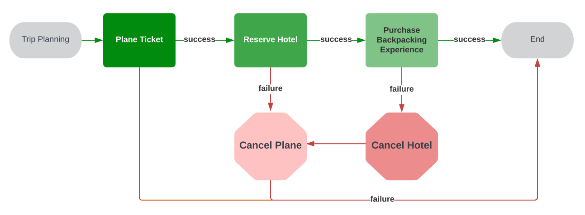

https://temporal.io/blog/saga-pattern-made-easy

### 使用 saga 进行旅行规划，但不带行李

上次你家人去当地公园玩时，每个人都在谈论 saga 设计模式，现在你想知道它是什么，你是否应该将它作为自己分布式系统设计的一部分，以及如何实现它。众所周知，软件设计是一种时尚趋势 。

### Saga的理由

如果你想知道 saga 模式是否适合你的应用场景，请扪心自问：你的逻辑是否涉及多个步骤，其中一些步骤跨越**机器、服务、分片或数据库**，而部分执行是不可取的？事实证明，这正是 saga 的用武之地。也许您正在检查库存，向用户的信用卡收费，然后完成订单。也许你正在管理供应链。Saga 模式之所以有用，是因为它基本上就像一台状态机，可以存储程序进度、防止信用卡多次刷卡、在必要时进行还原，并清楚地知道在断电的情况下如何安全地恢复到一致的状态。

用来解释 saga 模式如何弥补失败的常见生活实例是旅行计划。假设你很想去西雅图的杜瓦米什地区淋雨。你需要购买机票、预订酒店，并获得一张雷尼尔山背包旅行的门票。这三件事都是一环扣一环的：如果您买不到机票，就没有理由去买其他的票。如果你买到了机票却没地方住，你就会想取消机票预订（或重新预订酒店或找其他地方住）。最后，如果你订不到背包旅行的门票，那就真的没有其他理由来西雅图了，所以还不如取消整个旅行。(开玩笑）



上图：一个面对旅行计划失败进行补偿的简单模型

现实世界中有很多 "要么全做，要么不做" 的软件应用：如果你成功地向用户收取了商品费用，但你的履行服务却报告商品缺货，如果你不退还费用，用户就会不高兴。如果你遇到了相反的问题，不小心 "免费" 交付了商品，你就会被淘汰出局。如果协调机器学习数据处理流水线的机器崩溃了，但后续机器仍在继续处理数据，而它们的数据却无处上报，那么你可能会面临一笔非常昂贵的计算资源账单。 在所有这些情况下，Saga 模式都提供了某种 "进度跟踪" 和补偿代码，以处理这些 "要么全做，要么全不做" 的任务。在 Saga 术语中，这类 "要么全做，要么全不做" 的任务被称为长期事务。这并不一定意味着这类事务要运行 "很长时间"，只是与本地运行的、与单个数据库交互的事务相比，它们在逻辑时间上需要更多的步骤。

### 如何创作 saga？

Saga 由两部分组成：

1. 为 "倒退" 而定义的行为，如果你需要 "撤销" 某些事情（即补偿）
2. 努力向前迈进的行为（即保存状态，以便在失败时知道从哪里恢复）

本博客的忠实读者一定还记得我最近写过一篇关于补偿行为的文章。从上文可以看出，补偿只是 saga 设计模式的一半。上文提到的另一半本质上是整个系统的状态管理。补偿动作模式可以帮助你了解在单个步骤（或者用 temporal 术语来说，一个活动/activity）失败时如何恢复。但如果整个系统瘫痪了呢？从哪里开始恢复？因为并不是每个步骤都附带有补偿，所以你只能根据存储的补偿进行最佳猜测。Saga 模式会记录你当前所处的位置，这样你就可以继续向前迈进。

### 那么，如何在自己的代码中实现saga呢？

很高兴你这么问。

向前倾

在耳边低语

这是个有点小技巧的问题，因为使用 Temporal 运行代码时，你会自动保存状态，并在任何级别失败时重试。这就意味着，使用 Temporal 的 saga 模式非常简单，只需在某个步骤（活动）失败时编写你希望采取的补偿措施即可。搞定。

这种魔力背后的_原因_是 Temporal 在设计上自动跟踪程序的进度，并能在发生灾难性故障时从中断的地方重新开始。此外，Temporal 还会在活动失败时重试，除了指定重试策略外，你不需要添加任何代码，例如：

```java
RetryOptions retryoptions = RetryOptions.newBuilder()
       .setInitialInterval(Duration.ofSeconds(1))
       .setMaximumInterval(Duration.ofSeconds(100))
       .setBackoffCoefficient(2)
       .setMaximumAttempts(500).build();
```

要进一步了解这种自动机制是如何工作的，请继续关注我即将发表的关于编排和协调（实现 saga 的两种常用方法）的文章。

因此，要表达我的程序的高层逻辑，包括预订假期的步骤以及我希望在失败时采取的补偿措施，它看起来就像下面的伪代码：

```java
try:
   registerCompensationInCaseOfFailure(cancelHotel)
   bookHotel
   registerCompensationInCaseOfFailure(cancelFlight)
   bookFlight
   registerCompensationInCaseOfFailure(cancelExcursion)
   bookExcursion
catch:
   run all compensation activities
```

在 Java 中，Saga 类会为您记录补偿信息：

```java
@Override
public void bookVacation(BookingInfo info) {
   Saga saga = new Saga(new Saga.Options.Builder().build());
   try {
       saga.addCompensation(activities::cancelHotel, info.getClientId());
       activities.bookHotel(info);

       saga.addCompensation(activities::cancelFlight, info.getClientId());
       activities.bookFlight(info);

       saga.addCompensation(activities::cancelExcursion, 
                            info.getClientId());
       activities.bookExcursion(info);
   } catch (TemporalFailure e) {
       saga.compensate();
       throw e;
   }
}
```

在其他语言的 SDK 中，您可以自己轻松编写 addCompensation 和 compensate 函数。下面是 Go 语言的一个版本：

```go
func (s *Compensations) AddCompensation(activity any, parameters ...any) {
	s.compensations = append(s.compensations, activity)
	s.arguments = append(s.arguments, parameters)
}

func (s Compensations) Compensate(ctx workflow.Context, inParallel bool) {
	if !inParallel {
		// Compensate in Last-In-First-Out order, to undo in the reverse order that activies were applied.
		for i := len(s.compensations) - 1; i >= 0; i-- {
			errCompensation := workflow.ExecuteActivity(ctx, s.compensations[i], s.arguments[i]...).Get(ctx, nil)
			if errCompensation != nil {
				workflow.GetLogger(ctx).Error("Executing compensation failed", "Error", errCompensation)
			}
		}
	} else {
		selector := workflow.NewSelector(ctx)
		for i := 0; i < len(s.compensations); i++ {
			execution := workflow.ExecuteActivity(ctx, s.compensations[i], s.arguments[i]...)
			selector.AddFuture(execution, func(f workflow.Future) {
				if errCompensation := f.Get(ctx, nil); errCompensation != nil {
					workflow.GetLogger(ctx).Error("Executing compensation failed", "Error", errCompensation)
				}
			})
		}
		for range s.compensations {
			selector.Select(ctx)
		}
	}
}
```

步骤和补偿的高级 Go 代码与 Java 版本非常相似：

```go
func TripPlanningWorkflow(ctx workflow.Context, info BookingInfo) (err error) {
   options := workflow.ActivityOptions{
       StartToCloseTimeout: time.Second * 5,
       RetryPolicy:         &temporal.RetryPolicy{MaximumAttempts: 2},
   }

   ctx = workflow.WithActivityOptions(ctx, options)

   var compensations Compensations

   defer func() {
       if err != nil {
           // activity failed, and workflow context is canceled
           disconnectedCtx, _ := workflow.NewDisconnectedContext(ctx)
           compensations.Compensate(disconnectedCtx, true)
       }
   }()

   compensations.AddCompensation(CancelHotel)
   err = workflow.ExecuteActivity(ctx, BookHotel, info).Get(ctx, nil)
   if err != nil {
       return err
   }

   compensations.AddCompensation(CancelFlight)
   err = workflow.ExecuteActivity(ctx, BookFlight, info).Get(ctx, nil)
   if err != nil {
       return err
   }

   compensations.AddCompensation(CancelExcursion)
   err = workflow.ExecuteActivity(ctx, BookExcursion, info).Get(ctx, nil)
   if err != nil {
       return err
   }

   return err
}
```

上述高级代码序列被称为 temporal 工作流。而且，如前所述，通过使用 Temporal 运行，我们不必担心通过事件源或添加重试和重启逻辑来实现任何跟踪进度的 bookkeeping 功能，因为这些都是免费提供的。因此，在编写使用 Temporal 运行的代码时，你只需担心如何编写补偿，其余的都是免费提供的。

### 幂等

好吧，还有第二件事需要 "担心"。你可能还记得，saga 由两部分组成，第一部分是我们之前编码的补偿。第二部分是 "努力向前推进"，包括面对失败时可能重新尝试某项活动。让我们深入了解其中一个步骤，好吗？Temporal 承担了重试和跟踪整体进度的所有重任，但由于代码可以重试，程序员需要确保每个 Temporal 活动都是幂等的。这意味着无论调用一次还是多次，观察到的 bookFlight 结果都是一样的。说得具体一点，设置某个字段 foo=3 的函数是幂等的，因为无论调用多少次，之后 foo 都是 3。函数 foo += 3 不是幂等的，因为 foo 的值取决于函数被调用的次数。非幂等性有时看起来更微妙：如果数据库允许重复记录，那么调用 INSERT INTO foo (bar) VALUES (3) 的函数会轻率地在表中创建与调用次数相同的记录，因此不是幂等的。发送电子邮件或转账的函数的天然实现也不是默认幂等。

如果你正在慢慢退缩，因为你的真实世界应用程序要做的事情比 set foo=3 复杂得多，那么请振作起来。有一个解决方案。您可以使用一个独特的标识符（称为idempotency key，有时也称为 referenceId 或类似标识符）来唯一标识一个特定的事务，并确保酒店预订事务只有效发生一次。idempotency key 的定义方式可根据应用程序的需要而定。在旅行计划应用程序中，BookingInfo 中的一个字段 clientId 用于唯一标识事务。

```go
type BookingInfo struct {
   Name     string
   ClientId string
   Address  string
   CcInfo   CreditCardInfo
   Start    date.Date
   End      date.Date
}
```

在上述 Java 工作流代码中，您可能还看到了用于注册补偿的 clientId：

```java
saga.addCompensation(activities::cancelHotel, info.getClientId());
```

不过，使用 clientId 作为键可以限制某个人同时预订多个假期。这可能正是我们想要的。但是，一些业务应用程序可能会选择通过结合客户 ID 和工作流 ID 来建立一个唯一密钥，以允许每个客户同时预订多个假期。如果您想要一个真正唯一的幂等 key，您可以向工作流传递一个 UUID。您可以根据自己应用程序的需要做出选择。

许多处理资金的第三方应用程序接口已经接受了用于此目的的幂等键。如果需要自己实现这样的功能，可以使用原子写入来记录迄今为止已查看过的幂等键，如果某个操作的幂等键在 "已查看过" 集合中，就不要执行该操作。

### 优势与复杂性

saga 模式确实会增加代码的复杂性，因此不要因为有了微服务就在代码中实现它，这一点很重要。但是，如果您需要完成一项涉及多个服务的任务（如预订机票和酒店），而部分执行实际上并不成功，那么 saga 将是您的朋友。此外，如果你发现自己的 saga 变得特别笨重，可能就需要重新考虑如何划分微服务，并卷起袖子进行重构了。总的来说，Temporal 可以让你在代码中实现 saga 模式变得相对简单，因为你只需编写每一步所需的补偿即可。敬请期待我的下一篇文章，在这篇文章中，我将深入探讨 saga 和订阅场景，Temporal 在降低 saga 工作的复杂性方面尤为突出。

使用本文所述代码的完整版本库可在 GitHub 上找到：

- [Java code](https://github.com/efortuna/sagas-temporal-trip-booking/tree/main/java)
- [Go code](https://github.com/efortuna/sagas-temporal-trip-booking/tree/main/go)

如果您想了解其他使用 Temporal 的 saga 教程，请查看以下资源：

- [Java: Booking Saga](https://github.com/temporalio/samples-java/blob/main/src/main/java/io/temporal/samples/bookingsaga/README.md)
- [Go: Money Transfer Saga](https://github.com/temporalio/samples-go/tree/main/saga)
- [PHP: Money Transfer Saga](https://github.com/temporalio/samples-php/tree/master/app/src/Saga)
- [Python: Booking Saga](https://github.com/rachfop/temporal-sagas)
- [TypeScript: Money Transfer Saga](https://github.com/temporalio/samples-typescript/tree/main/saga)

此外，我的一位同事 Dominik Tornow 还在 YouTube 上介绍了 saga。

在我们的课程、教程、文档和视频中了解更多有关 Temporal 的信息。

### 注释

1. 显然，不要因为它是新的热点就重新设计你的系统。除非它是一个新的 JavaScript 框架。那就赶紧用 npm 安装那个新软件包吧。😜
2. 别担心，saga 并不是一种趋势，自上世纪 80 年代以来，saga 就一直存在于数据库中。您可以放心，因为您的项目设计经典优雅。

3. 这并不是说作者对这种情况完全没有经验。

4. 逻辑时间是分布式计算中的一个概念，用于描述分布式计算中不同机器上发生事件的时间，因为机器可能没有物理同步的全局时钟。逻辑时间只是这些机器上发生的事件的因果排序。就长期运行的事务而言，它基本上可以归结为在不同机器上发生的许多 "步骤"。
