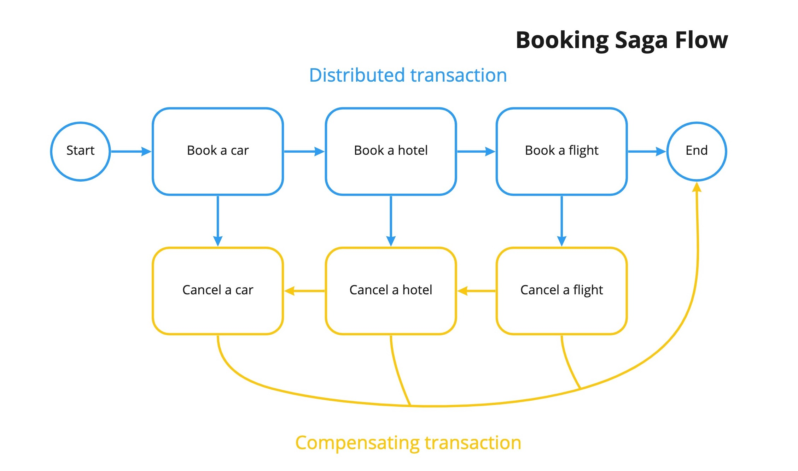

https://learn.temporal.io/tutorials/php/booking_saga/

用 Saga 模式和 Temporal 创建 PHP 旅行预订系统

## 简介

想象一下，我们提供的服务可以让人们预订旅行。预订定期旅行通常包括几个步骤：

- 预订汽车。
- 预订酒店。
- 预订航班。

客户要么什么都想订，要么什么都不想订。不预订飞机就预订酒店是毫无意义的。另外，想象一下，在这个交易中，每个预订步骤都是通过专门的服务或微服务来实现的。

所有这些步骤共同构成了一个跨越多个服务和数据库的分布式事务。为确保预订成功，所有三个微服务都必须完成各个本地事务。如果其中任何一个步骤失败，前面完成的所有事务都应相应撤销。我们不能简单地 "删除" 之前的事务或 "回到过去"--尤其是在涉及到资金和预订的情况下，拥有不可更改的尝试和失败记录非常重要。因此，我们应该积累一份失败后的补偿行动清单。


## 回顾 Saga 架构模式

要做好分布式事务管理是非常困难的。对于长期运行的工作来说，Saga 是最久经考验的设计模式之一：

- Saga 使用一系列本地事务来提供事务管理。
- 本地事务是 saga 参与者（微服务）执行工作的单位。
- 属于 Saga 的每个操作都可以通过补偿事务回滚。
- Saga 模式保证所有操作都能成功完成，或者运行相应的补偿事务来撤销先前完成的工作。

实现 Saga 模式可能很复杂，但幸运的是，Temporal 提供了对 Saga 模式的原生支持。这意味着处理所有回滚和运行补偿事务都由 Temporal 内部完成。



上图显示了如何在前面讨论过的在线旅行预订场景中将 Saga 模式可视化。

## 工作流的实现

我们需要做的第一件事就是编写一个业务流程--旅行预订的高级流程。我们称之为 TripBookingWorkflow：

```java
class TripBookingWorkflow implements TripBookingWorkflowInterface
{
    /** @var \Temporal\Internal\Workflow\ActivityProxy|TripBookingActivitiesInterface */
    private $activities;

    public function __construct()
    {
        $this->activities = Workflow::newActivityStub(
            TripBookingActivitiesInterface::class,
            ActivityOptions::new()->withStartToCloseTimeout(CarbonInterval::hour(1))
        );
    }

    public function bookTrip(string $name)
    {

    }
}
```

为简单起见，我们假设所有预订服务（汽车、酒店和航班）都由一个活动 TripBookingActivitiesInterface 管理。但这不是必要条件。好了，现在我们需要告诉 Temporal 我们要使用 Saga。
